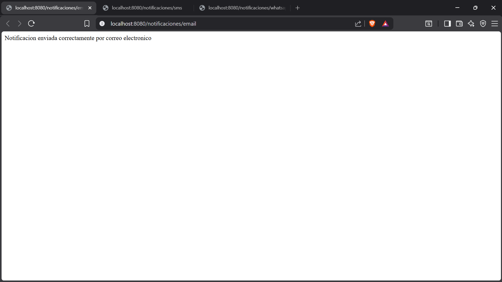
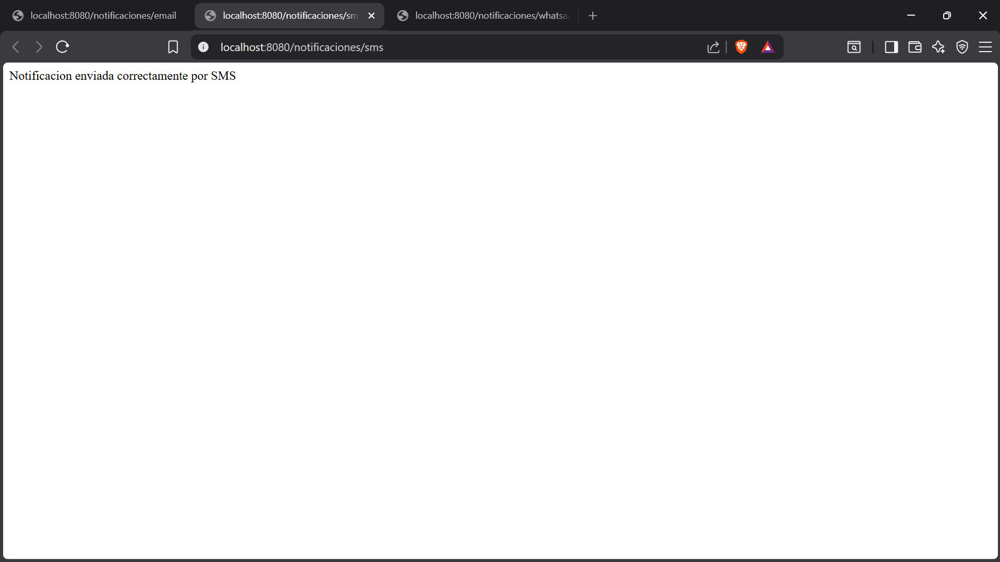
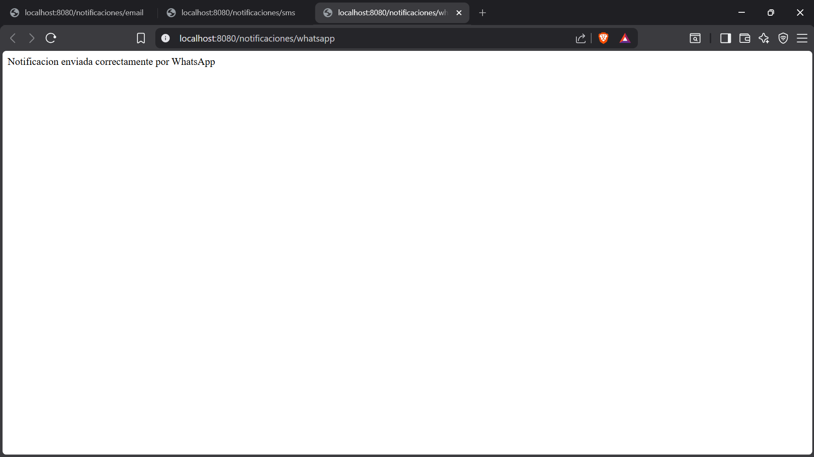

# Sistema de Notificaciones — Patrón Factory Method con Spring Boot

## Descripción general

Este proyecto fue elaborado en el entorno de desarrollo Visual Studio Code
como parte del taller sobre el patrón de diseño Factory Method trabajado en
el programa de Análisis y Desarrollo de Software del SENA. El sistema
consiste en una API REST construida con Java y Spring Boot, cuyo objetivo
es demostrar cómo el patrón Factory Method centraliza la creación de objetos
y evita que las clases cliente dependan directamente de implementaciones
concretas.

## Tecnologías utilizadas

- Java 17
- Spring Boot 4.1.0
- Spring Web
- Maven
- Visual Studio Code

## Situación planteada

Una empresa desea enviar notificaciones a sus usuarios. Dependiendo de la
solicitud recibida, el sistema debe generar una notificación por correo
electrónico, por SMS o por WhatsApp. La creación de estas notificaciones
no se realiza directamente en el controlador ni en el servicio, sino que
se delega completamente a la fábrica.

## Estructura del proyecto
sistemafactory/
├── docs/
│   ├── captura-email.png
│   ├── captura-sms.png
│   └── captura-whatsapp.png
├── src/
│   └── main/
│       └── java/
│           └── com/sena/sistemafactory/
│               ├── SistemafactoryApplication.java
│               ├── interfaces/
│               │   └── Notificacion.java
│               ├── implementations/
│               │   ├── NotificacionEmail.java
│               │   ├── NotificacionSMS.java
│               │   └── NotificacionWhatsApp.java
│               ├── factory/
│               │   └── NotificacionFactory.java
│               ├── servicio/
│               │   └── NotificacionServicio.java
│               └── controlador/
│                   └── NotificacionControlador.java
└── pom.xml

## Identificación de los componentes del patrón

### Producto — `Notificacion.java`

La interfaz `Notificacion` define el contrato común que todas las
implementaciones deben cumplir. Cualquier clase que quiera ser una
notificación debe implementar el método `enviar()`.

### Productos Concretos

Las clases `NotificacionEmail`, `NotificacionSMS` y `NotificacionWhatsApp`
implementan la interfaz y definen su propio comportamiento. Todas hacen
lo mismo pero de manera diferente, sin que el resto del sistema sepa cuál
se está usando.

### Fábrica — `NotificacionFactory.java`

La fábrica es la única clase que conoce las implementaciones concretas.
Recibe el tipo como texto, evalúa cuál instanciar y retorna el objeto
correspondiente. Si el tipo no es válido, lanza una excepción explícita.

### Servicio — `NotificacionServicio.java`

El servicio solicita el objeto a la fábrica y ejecuta el método `enviar()`.
No crea objetos directamente ni conoce las implementaciones.

### Controlador — `NotificacionControlador.java`

El controlador expone el endpoint `GET /notificaciones/{tipo}` y delega
la lógica al servicio. No conoce ni la fábrica ni las implementaciones.

## Flujo del sistema

**Paso 1 — El cliente realiza una petición:**
El usuario accede a `http://localhost:8080/notificaciones/email`
desde el navegador.

**Paso 2 — La solicitud llega a la fábrica:**
El controlador recibe el tipo `email` y lo envía al servicio.

**Paso 3 — La fábrica evalúa qué tipo crear:**
El servicio llama a `NotificacionFactory.crearNotificacion("email")`.
La fábrica evalúa el tipo con `equalsIgnoreCase`.

**Paso 4 — La fábrica instancia el objeto:**
Al coincidir con `EMAIL`, la fábrica retorna `new NotificacionEmail()`.

**Paso 5 — La fábrica retorna el objeto:**
El servicio recibe el objeto como tipo `Notificacion` (la interfaz),
no como `NotificacionEmail`.

**Paso 6 — El cliente utiliza el objeto mediante la interfaz común:**
El servicio ejecuta `notificacion.enviar()` y el controlador retorna
el mensaje al navegador.

## Evidencias del funcionamiento

### GET /notificaciones/email

### GET /notificaciones/sms

### GET /notificaciones/whatsapp

## Actividad de reflexión

### 1. ¿Qué problema busca solucionar el patrón Factory Method?

Ya analizando detalladamente el flujo del sistema, se puede entender
que el patrón Factory Method soluciona el problema del alto acoplamiento
que se genera cuando las clases crean objetos directamente usando `new`.
Sin este patrón, cada vez que se agregara un nuevo tipo de notificación
habría que modificar el controlador, el servicio y cualquier otra clase
que instancie objetos. Con Factory Method, esa lógica queda centralizada
en un único lugar y el resto del sistema no necesita cambiar.

### 2. ¿Por qué no es recomendable crear objetos directamente en todas las clases del sistema?

No es recomendable porque genera dependencias directas entre clases.
Si el controlador o el servicio usaran `new NotificacionEmail()`, estarían
atados a esa implementación concreta. Cualquier cambio en la clase
`NotificacionEmail` podría afectar todas las clases que la instancian.
Además, la lógica de creación termina repetida en múltiples partes del
sistema, lo que dificulta el mantenimiento. El patrón Factory Method
resuelve esto concentrando toda esa responsabilidad en un solo lugar.

### 3. ¿Qué función cumple la fábrica dentro del patrón?

La fábrica es la clase encargada exclusivamente de decidir qué objeto
crear y de instanciarlo. En este proyecto, `NotificacionFactory` recibe
el tipo de notificación como texto, evalúa cuál implementación corresponde
y retorna el objeto ya creado. Es la única clase del sistema que conoce
las implementaciones concretas. El servicio y el controlador únicamente
conocen la interfaz `Notificacion`, no las clases que la implementan.

### 4. ¿Cuál es la diferencia entre el producto y los productos concretos?

El producto es la interfaz `Notificacion`, que define el comportamiento
común que todos los tipos de notificación deben tener. Es una abstracción,
no tiene implementación propia. Los productos concretos son las clases
`NotificacionEmail`, `NotificacionSMS` y `NotificacionWhatsApp`, que
implementan esa interfaz y definen cómo se realiza el envío en cada caso.
La diferencia clave es que el producto define el qué y los productos
concretos definen el cómo.

### 5. ¿Qué ventajas aporta Factory Method en aplicaciones desarrolladas con Spring Boot?

En aplicaciones Spring Boot, Factory Method permite que el controlador
y el servicio trabajen únicamente con interfaces, sin conocer las
implementaciones. Esto hace que el código sea más fácil de entender,
de probar y de extender. Si se necesita agregar un nuevo tipo de
notificación, solo se crea una nueva clase y se actualiza la fábrica.
El controlador y el servicio permanecen exactamente igual, tal como
el taller demuestra con el ejemplo del reporte de Word que se agrega sin
tocar ninguna otra capa.

### 6. ¿Qué ocurriría si fuera necesario agregar un nuevo tipo de objeto al sistema?

Ya analizando detalladamente el flujo del sistema, se observa que
agregar un nuevo tipo es un proceso mínimo y controlado. Bastaría con
crear una nueva clase que implemente la interfaz `Notificacion`, por
ejemplo `NotificacionPush`, y agregar un bloque `if` en la fábrica para
reconocer el nuevo tipo. El controlador permanecería igual, el servicio
permanecería igual y la interfaz permanecería igual. Solo se tocan dos
archivos: la nueva implementación y la fábrica. Esa es precisamente
una de las principales ventajas que el taller menciona y destaca del patrón.

### 7. ¿Cómo se relaciona Factory Method con el principio de bajo acoplamiento?

El bajo acoplamiento significa que las clases dependen lo menos posible
unas de otras. Factory Method favorece este principio porque el servicio
y el controlador no dependen de `NotificacionEmail`, `NotificacionSMS`
ni `NotificacionWhatsApp`. Solo dependen de la interfaz `Notificacion`
y de la fábrica. Si mañana se elimina o reemplaza una implementación,
ninguna otra capa necesita modificarse. La fábrica actúa como escudo
que absorbe todos los cambios relacionados con la creación de objetos,
protegiendo al resto del sistema.

## Conclusión

El desarrollo de este proyecto permitió comprobar de manera práctica
cómo el patrón Factory Method mejora la organización y el mantenimiento
de una aplicación. Sin este patrón, el controlador necesitaría conocer
cada tipo de notificación y crear los objetos directamente, generando
un acoplamiento que crece con cada nuevo tipo agregado.

Ya analizando detalladamente el flujo del sistema, se concluye que cada
capa cumplió exactamente con su responsabilidad, la interfaz define el
contrato, las implementaciones definen el comportamiento específico, la
fábrica centraliza la creación, el servicio coordina la lógica y el
controlador expone el acceso. Esa separación es lo que hace que el
sistema sea mantenible...